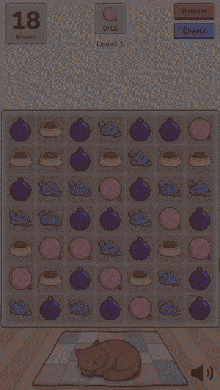

# Cozy Match-3

Unity WebGL match-3 in portrait 9:16: full board/match/gravity core, four boosters with all
combinations, data-driven obstacles, level goals, 12 levels and an on-screen cheat panel.

*Русская версия: [README.ru.md](README.ru.md)*

<p align="center"></p>

**▶ Play in browser:** [WebGL demo](https://cozy-match3.klyushin-mixail.workers.dev/)

## Stack

Unity **6000.3.21f1** · WebGL · URP · uGUI · Zenject · UniTask · R3 1.3.1 (NuGet core) · DOTween ·
New Input System · Unity Test Framework.

## Getting started

1. Open `cozy-match3/` with Unity 6000.3.21f1.
2. Open `Assets/Game/Scenes/Boot.unity` and press Play (`Boot` bootstraps and loads `Game`).
3. WebGL build: both scenes are already in Build Settings; a custom WebGL template handles the 9:16
   letterbox and the 1080×1920 backbuffer cap.

Cheats are compiled behind the `MATCH3_CHEATS` scripting define (on for Editor and development
builds). The `Match3.Cheats` assembly declares `defineConstraints: ["MATCH3_CHEATS"]`, so without
the define it does not compile into the build at all.

## What is implemented

- **Core loop** — swap validation, matches, obstacle damage, clear, gravity with diagonal slide,
  refill from spawners, cascades (automatches while chips fall), shuffle on deadlock, idle hint,
  remaining-moves bonus on win.
- **Boosters** — rocket (match 4), bomb (L/T match), rainbow ball (match 5), airplane (2×2 square)
  with "smart" targeting toward the level goals; all 10 cells of the combination matrix; booster
  chain reactions resolved in waves.
- **Obstacles** — plain crate, colored crate, crate that changes color every turn, unbreakable
  blocker, multi-HP crates and nesting up to depth 3. They are described by **data**
  (`ElementDefinition` axes + damage-source rules), not by an enum: adding ice/chain/vine changes no
  line inside `Match3.Resolve`.
- **Goals** — collect chips of a color, boosters or obstacles; several goals per level, order is
  both display order and targeting priority.
- **Levels & flow** — 12 level assets plus a catalog, per-level move limit, win → next level,
  loss → replay, progress saved to PlayerPrefs.
- **Cheats** — go to level, win level, lose level, +5 moves, place any booster on a tapped cell,
  show/apply the run seed, free moves, coordinate grid overlay, hint now / disable hints. Screen
  buttons only, no hotkeys; the panel is draggable.
- **Presentation** — pooled views, destroy FX played before chips start falling, booster/combination
  FX, HUD with goals and popups, sound effects.

## Architecture in a minute

- **A turn is computed synchronously and in full**, then handed to presentation as an ordered
  *transcript* of events. The model never waits for animations; the view never mutates or even reads
  the board while a turn is playing back.
- **`Modules/*` are pure C#** (`noEngineReferences`) — the rules are testable without Unity and
  without a scene. `Features/*` hold presentation, HUD, progression and cheats; `Bootstrap` holds the
  Zenject composition. `Modules` never reference `Features`.
- **Deterministic** — one injected `IRandom` per level attempt, fixed consumption order. Same seed
  plus same inputs ⇒ identical board hashes, which the replay harness asserts.
- **RESOLVE pipeline** — DETECT → CLASSIFY → SPAWN → ACTIVATE → DAMAGE → CLEAR → ANIMATE → GRAVITY →
  REFILL → cascade, then POST-TURN (turn-based obstacles, goals, moves, shuffle).
- **WebGL constraints** — single-threaded: no threads, no blocking on async, no R3 time operators;
  time comes from UniTask or DOTween. No `Instantiate` or LINQ in the hot path.

## Repository layout

```
cozy-match3/Assets/Game/
  Scripts/Modules/      pure rules: Core, Board, Matching, Goals, Boosters, Resolve, Levels(+Authoring)
  Scripts/Features/     Gameplay, Hud, Progression, Cheats, Diagnostics
  Scripts/Bootstrap/    Zenject installers, composition root
  Scripts/EditorTools/  editor-only content authoring
  Content/              level assets, art, FX, SFX, prefabs, profiles
  Scenes/               Boot.unity, Game.unity
  Tests/                EditMode (bulk), PlayMode (smoke)
cozy-match3/docs/Internal/   GDD, architecture, task plan (Russian)
```

## Level format

`LevelConfig` (ScriptableObject) → `LevelData` (plain DTO) → `BoardBuilder` → `Board`. Tests build
levels from a plain string layout, without assets or a scene.

One token is 2 characters, tokens are space-separated, the first row is the top one:

```
..  random chip        t1..t6  chip of a given color   __  hole          ##  blocker
bx  crate (1 hp)       b2 / b3 crate with 2 / 3 hp
c1..c6  colored crate  cx  crate that changes color    rh / rv  rocket
bm  bomb               rb  rainbow ball                pl  airplane
```

Nesting is not written in the grid — it is listed by coordinate in `contents`. Every level is
validated on load: size, known tokens, cell reachability from spawners, no ready matches, at least
one legal move, reachable goals, nesting depth ≤ 3.

## Tests

Edit-mode tests over the pure modules cover matching, gravity, damage, nesting, boosters, the full
combination matrix, chains, goals, the turn cycle, shuffle, hints, level parsing/validation,
determinism replay and a greedy-bot winrate run over all 12 levels. Play-mode holds a single smoke
test (Boot → Game, level builds, scripted swap, win popup).

Run from `Window > General > Test Runner`, or headless:

```
Unity.exe -batchmode -projectPath cozy-match3 -runTests -testPlatform EditMode -testResults results.xml
```

## Documentation

`cozy-match3/docs/Internal/` (Russian) is the source of truth: `gdd-match3.md` (design decisions and
edge cases), `architecture.md` (where each rule lives in code), `tasks.md` (development plan and
status), plus art and balance notes.

Per `tasks.md`, everything is implemented except the release-build checks left open in T25/T32 —
verifying the Build Report of a release WebGL build for cheat assets, and measuring the final build
size.

## License

The game code and original art are released under the [MIT License](LICENSE). Third-party packages
in `cozy-match3/Assets/Plugins/` and `cozy-match3/Assets/Packages/` (Zenject, DOTween, UniTask, R3,
NuGet dependencies) and the Nunito font keep their own licenses.
